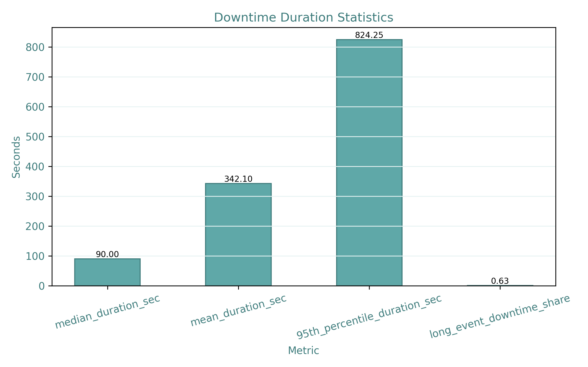
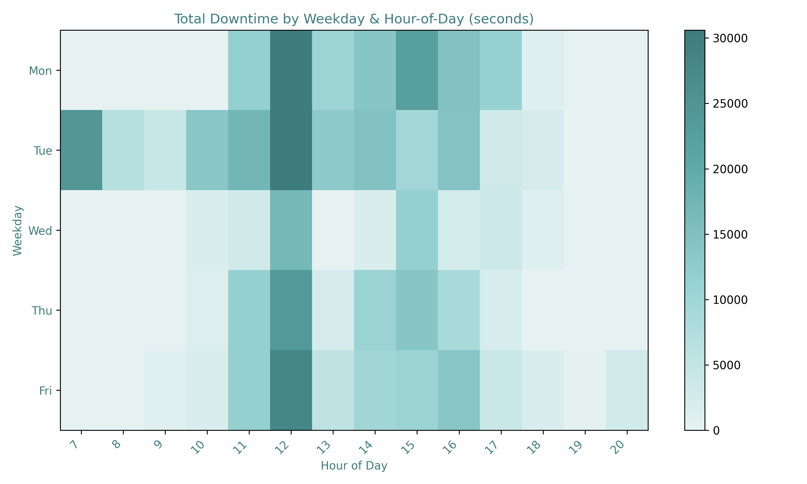
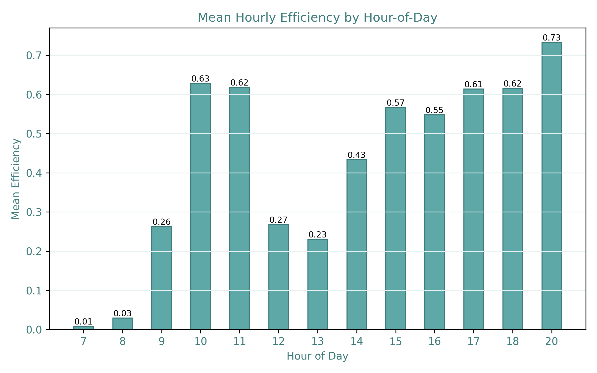
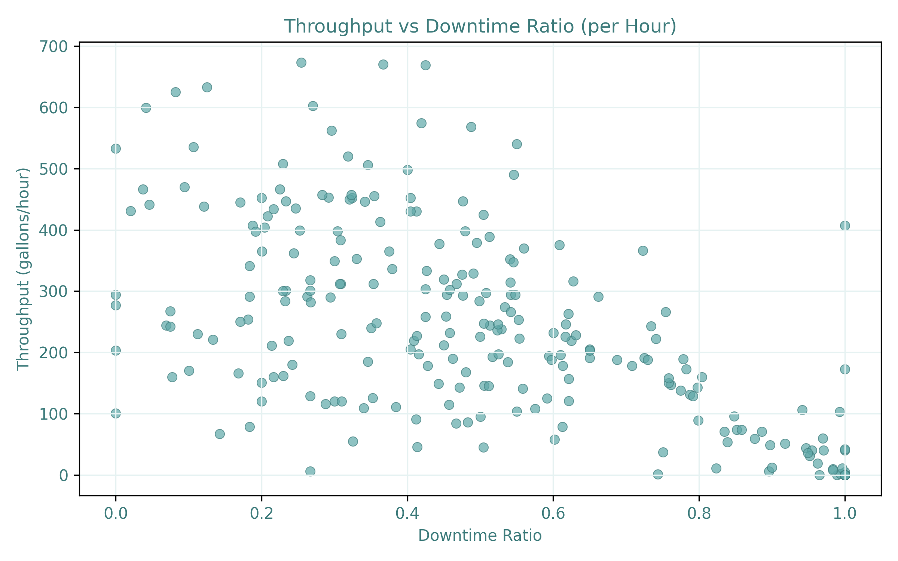
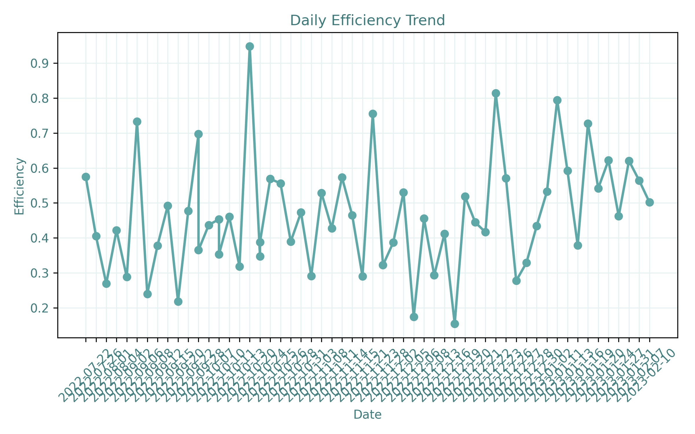
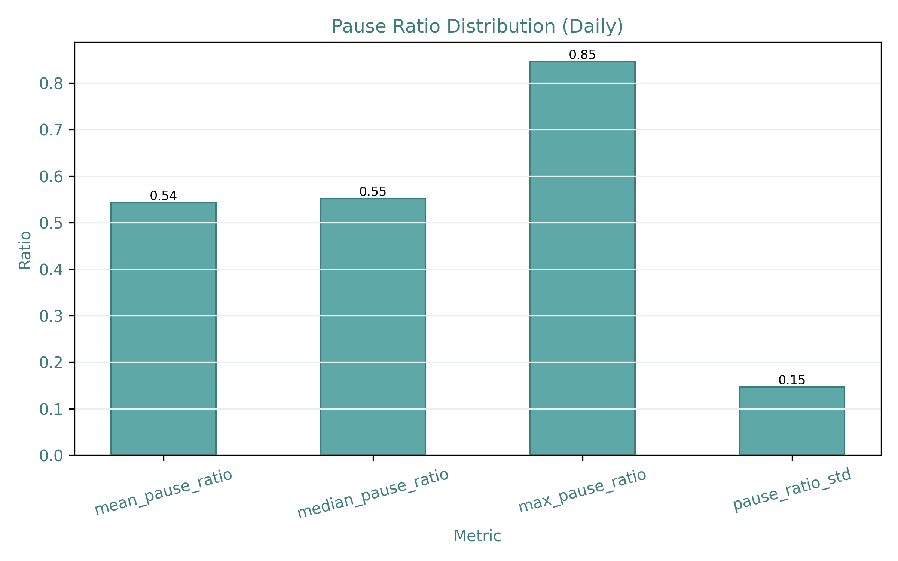
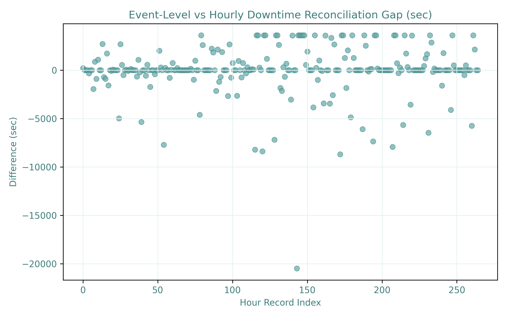

# 🏭 pandas-manufacturing-downtime-analytics

A **Pandas-based manufacturing operations analytics** project focused on analyzing production throughput, downtime behavior, and operational inefficiencies in an industrial beverage bottling line.

The project follows a **layered data pipeline architecture**, separating raw data cleaning, feature engineering, multi-resolution analysis, and visual storytelling.

This project answers how downtime concentrates across the production timeline, how micro-level events propagate into hourly and daily performance losses, and how consistent operational metrics are across multiple aggregation layers.

---

## 📌 Project Overview

Operational efficiency in manufacturing cannot be understood only through daily summaries or total production numbers.  
True optimization requires analyzing how machines behave at the event level and validating how those behaviors aggregate into hourly and daily operational performance.

The project provides:

- A multi-stage data pipeline (`raw → cleaned → featured → analytics`)
- Event sessionization and downtime duration engineering
- Multi-resolution time-series validation (event → hour → day)
- Throughput vs downtime correlation analysis
- Operational efficiency and loss pattern detection
- Static PNG visualizations and optional interactive dashboards

---

## 📊 Dataset

[**Industrial Production - Beverage Bottling Line**](https://www.kaggle.com/datasets/gabrielaugustodavid/industrial-production-beverage-bottling-line)

The dataset contains four complementary tables representing different aggregation layers of the same production system.

**Key tables include:**
- `downtime_event_log` — Event-level downtime logs with start time, end time, and recorded downtime duration
- `hourly_operation_breakdown` — Hourly operational metrics including monitored time, operation time, downtime, and efficiency
- `processed_hourly` — Hourly production throughput measured in gallons
- `daily_operation_summary` — Daily production summaries including efficiency, operation time, pause time, and production volume

**Data organization:**
- Raw data: `data/raw`
- Cleaned data: `data/cleaned`
- Feature-engineered data: `data/featured`

---

## 📈 Example Outputs

### ⏱️ Downtime Intelligence
- Downtime event duration distribution
- Downtime clustering and burst detection
- Hourly downtime density heatmap
- Validation of recorded downtime vs computed durations




---

### ⚙️ Hourly Performance Analysis
- Production throughput vs downtime correlation
- Zero-production window detection
- Hourly efficiency decay patterns




---

### 📆 Daily Operational Stability
- Daily efficiency trend analysis
- Pause ratio distribution
- Best vs worst operational days
- Stability and variance analysis




---

### 🔎 Cross-Level Consistency Validation
- Event-level vs hourly downtime reconciliation
- Hourly vs daily aggregation consistency



---

### 🌐 Interactive Dashboard

- Interactive Dashboard Demo  


🖱️ **Live Dashboard:**  
<a href="https://busracevik.github.io/pandas-manufacturing-downtime-analytics/index.html" target="_blank">View Interactive Dashboard</a>

---

## 🔍 Key Insight: Pareto-Like Downtime Behavior

Operational losses are not evenly distributed across the production timeline.  
A small number of clustered downtime windows account for a disproportionate share of total lost production time, confirming a Pareto-like behavior in operational inefficiencies.

Cross-validation between event logs and hourly summaries reveals minor aggregation gaps, highlighting the importance of validation layers in real-world industrial data pipelines.

---

## 📁 Project Structure

```text
pandas-manufacturing-downtime-analytics/
│
├── data/
│   ├── raw/                # Original Excel dataset
│   ├── cleaned/            # Cleaned and validated tables
│   └── featured/           # Feature-engineered analytical datasets
│
├── outputs/
│   ├── tables/             # Aggregated analytical tables
│   └── figures/            # Static visualizations
│
├── docs/
│   ├── index.html          # Interactive dashboard
│   └── demo.gif            # Preview
│
├── src/
│   ├── data_processing/
│   │   ├── data_preparation.py
│   │   └── feature_engineering.py
│   │
│   ├── analysis/
│   │   ├── event_analysis.py
│   │   ├── hourly_analysis.py
│   │   └── daily_analysis.py
│   │
│   └── visualization/
│       ├── plots.py
│       └── dashboard.py
│
├── main.py                 # End-to-end pipeline execution
├── requirements.txt
└── README.md
```

---

## 🛠 Technologies Used

- **Python** – Core programming language

- **Pandas** – Data preprocessing and analytics

- **NumPy** – Numerical computations

- **Matplotlib** – Static visualizations

- **Plotly** – Interactive dashboards

---

## 🧠 Analytical Approach

This project emphasizes **operational interpretability and process understanding** rather than predictive modeling.  
No machine learning models are used.

Instead, the analysis relies on:

- Event-level time reconstruction
- Time-based aggregation and validation
- Throughput and downtime correlation analysis
- Multi-resolution consistency checks

The focus is on explaining **where operational losses occur and how they propagate through the production timeline**.

---

## 📐 Core Metrics & Definitions

### ⏱️ Downtime Duration

**Definition:**

$$
\text{Downtime Duration} = \text{Downtime End Time} - \text{Downtime Start Time}
$$

**Explanation:**  
Represents the length of each downtime event.

---

### ⏳ Hourly Downtime Ratio

**Definition:**

$$
\text{Downtime Ratio}_{hour} = \frac{\text{Downtime}_h}{\text{Monitored Time}_h}
$$

**Explanation:**  
Measures the proportion of lost production time per hour.

---

### ⚙️ Throughput

**Definition:**

$$
\text{Throughput} = \frac{\text{Total Production Volume}}{\text{Operation Time}}
$$

**Explanation:**  
Measures production efficiency over time.

---

### 📊 Daily Efficiency

**Definition:**

$$
\text{Efficiency}_{day} = \frac{\text{Operation Time}}{\text{Monitored Time}}
$$

**Explanation:**  
Represents overall daily operational utilization.

---

### 📉 Pause Ratio

**Definition:**

$$
\text{Pause Ratio} = \frac{\text{Pause Time}}{\text{Monitored Time}}
$$

**Explanation:**  
Measures the share of non-operational time within a production day.

---

### 🔄 Burst Detection

**Definition:**

$$
\text{is\_burst} = \begin{cases} \text{True} & \text{if gap from previous event} < 300\text{ sec} \\ \text{False} & \text{otherwise} \end{cases}
$$

**Explanation:**  
Identifies clustered downtime events that occur in rapid succession, indicating systemic machine instability rather than isolated failures.
